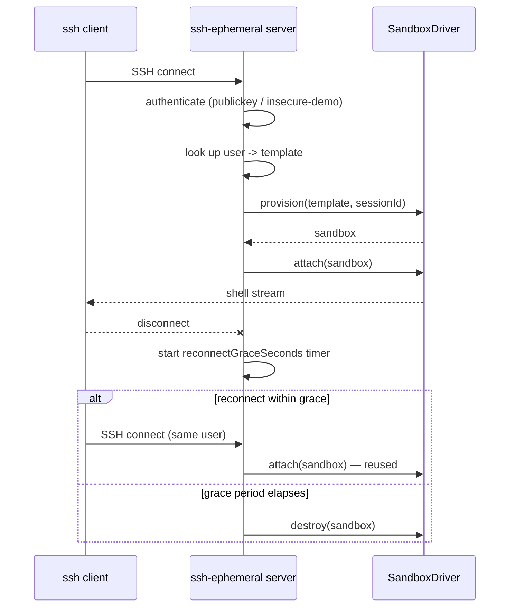

[](https://github.com/tsvirov/ssh-ephemeral/actions/workflows/ci.yml)
[](LICENSE)
[](package.json)

# ssh-ephemeral

> SSH into a fresh sandbox — a container spins up on connect and tears down on disconnect, per-user configurable via a simple template config. No manual provisioning, no leftover state.

**`ssh dev@host` — get a brand-new sandbox every time, gone the moment you disconnect.**

## Try it in 60 seconds

```bash
git clone https://github.com/tsvirov/ssh-ephemeral.git
cd ssh-ephemeral
npm install
npm run build
./examples/demo.sh
```

No Docker required — the demo runs entirely on the bundled `LocalProcessDriver`.
See [examples/README.md](examples/README.md) for the real, unedited output.

## The problem

Ad-hoc `docker run`/`ssh`-into-a-VM sessions accumulate. An engineer spins up
a throwaway compute session, forgets `--rm`, gets disconnected mid-work, and
six months later there's a graveyard of stopped-but-not-removed containers
and drifted state nobody remembers creating. Tools like
[ContainerSSH](https://containerssh.io/) solve this properly, but ask you to
learn a plugin/auth-backend model before your first successful connection.

## How it works



1. Client connects over SSH.
2. Server authenticates via `publickey` against the user's configured
   `authorized_keys` list (or accepts unconditionally in `insecureDemo` mode
   — demo/local use only, see `## Security`).
3. Server looks up the user's `template` in the config.
4. Server calls `driver.provision()` — `LocalProcessDriver` creates a fresh
   tmp directory; `DockerDriver` starts a fresh container.
5. Server calls `driver.attach()` and bridges the resulting stream to the SSH
   shell/exec channel.
6. On disconnect the sandbox is **not** destroyed immediately — a
   `reconnectGraceSeconds` timer starts.
7. If the same user reconnects within that window, they're reattached to the
   same live sandbox (no re-provisioning, no lost state in the tmp dir).
8. If the grace period elapses — or `maxTtlSeconds` is hit, even while still
   connected — a background janitor destroys the sandbox.

## Before / after

Before (the old way):

```bash
docker run -it --rm --memory=512m --cpus=1 node:22-slim sh
# ...forget --rm, or the process gets killed before cleanup runs...
docker ps -a | grep node          # orphaned containers pile up
docker rm $(docker ps -aq -f status=exited)   # manual cleanup, easy to forget
```

After (real output from `examples/demo.sh`, see [examples/README.md](examples/README.md) for the full unedited capture):

```
$ ssh -p 2222 -o StrictHostKeyChecking=no -o UserKnownHostsFile=/dev/null -o BatchMode=yes \
    demo@localhost 'echo $SSH_EPHEMERAL_SESSION && whoami'
demo-1783759578853-wdui15
elenatsvirova
```

No `docker rm`, nothing to remember — the sandbox above was gone
automatically once `reconnectGraceSeconds` plus one janitor sweep had
elapsed (`[janitor] evicted-idle sandbox=demo-1783759578853-wdui15
user=demo` in the server log).

## Install

```bash
git clone https://github.com/tsvirov/ssh-ephemeral.git
cd ssh-ephemeral
npm install
npm run build
node dist/cli.js ./ssh-ephemeral.yaml
```

## Config

Full example (every field below matches `src/config.ts`):

```yaml
listen:
  port: 2222
  hostKeyPath: ~/.ssh-ephemeral/host_key

# insecureDemo: true   # NEVER in production — accepts every connection unauthenticated

templates:
  dev:
    driver: local             # "local" | "docker"
    image: "node:22-slim"     # docker driver only
    memoryMb: 512              # docker driver only
    cpus: 1                    # docker driver only
    maxTtlSeconds: 3600
    reconnectGraceSeconds: 60

users:
  - name: alice
    keys:
      - "ssh-ed25519 AAAA... alice@laptop"
    template: dev
```

Defaults if omitted: `listen.port` 2222, `listen.hostKeyPath`
`~/.ssh-ephemeral/host_key`, `driver` `local`, `maxTtlSeconds` 3600,
`reconnectGraceSeconds` 60, `insecureDemo` false.

## CLI / usage

```bash
ssh-ephemeral [config-path]
# config-path defaults to ./ssh-ephemeral.yaml, or $SSH_EPHEMERAL_CONFIG if set
```

On first start the server generates an ed25519 host key and persists it at
`listen.hostKeyPath` (see `## Security` for why).

## Comparison

| | ssh-ephemeral | ContainerSSH |
|---|---|---|
| Setup | one YAML file | plugin + auth-backend configuration |
| Runtimes | local process, Docker | Docker, Kubernetes, and more via plugins |
| Extensibility | small `SandboxDriver` interface (4 methods) | full plugin system |
| Time to first successful connection | minutes | steeper — more moving parts to configure |

ContainerSSH is more powerful — more runtimes, a real plugin ecosystem.
ssh-ephemeral trades that power for a single YAML file that works
immediately.

## Security

- A local process (or a container without extra hardening) is **not** a
  microVM — do not use this for hostile multi-tenant workloads. See
  `## Roadmap` for firecracker/gVisor plans.
- The host key at `listen.hostKeyPath` is generated once and persisted
  **deliberately**. Regenerating it on every restart would train users to
  click through MITM warnings, which is strictly worse.
- `insecureDemo: true` disables all authentication (used only by
  `examples/demo.sh`). Never enable it on anything reachable from a network
  you don't fully trust — the server logs a loud warning on every connection
  while it's on, precisely so this doesn't go unnoticed.
- In production, only `publickey` authentication is supported — there is no
  password auth.
- Set `memoryMb`/`cpus` on every docker-driver template. Without limits, one
  user's sandbox can starve the host.

## Limitations

- `LocalProcessDriver` has no real pty (deliberately — see
  [Known risks](#known-risks) below) — `resize()` is a documented no-op
  there; only `DockerDriver` actually resizes a terminal.
- `DockerDriver` is **not runnable or tested on this dev machine** — there is
  no Docker installed here. It's covered only by the CI-only Docker
  integration job (`SSH_EPHEMERAL_DOCKER=1`, `ubuntu-latest`).
- Exec-channel exit codes aren't propagated — `ssh host 'cmd'` always reports
  exit status `0`, because the shared `SandboxDriver.attach()` primitive
  gives an interactive-shell stream, not a one-shot exec-with-exit-code call.

### Known risks

| Risk | Mitigation |
|---|---|
| No node-pty (native builds are a common source of cross-OS CI breakage) | Not used; plain pipes are enough for the local driver's tests and demo |
| Docker unavailable on this dev machine | All core logic is tested via `LocalProcessDriver`; `DockerDriver` is exercised only in the CI-only Docker job |
| Host key / private keys accidentally committed | `.gitignore` excludes `*.pem`, `host_key*`, `id_*`; the generated demo host key is never committed |

## Roadmap (not yet implemented)

- microVM isolation (firecracker/gVisor) for real hostile-multi-tenant safety
- multi-node scheduling — spread sandboxes across more than one host
- real exec exit-code propagation
